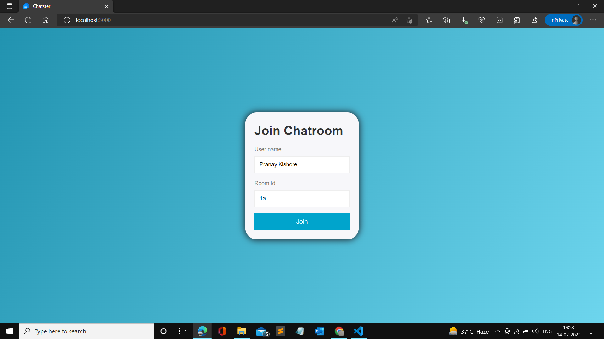
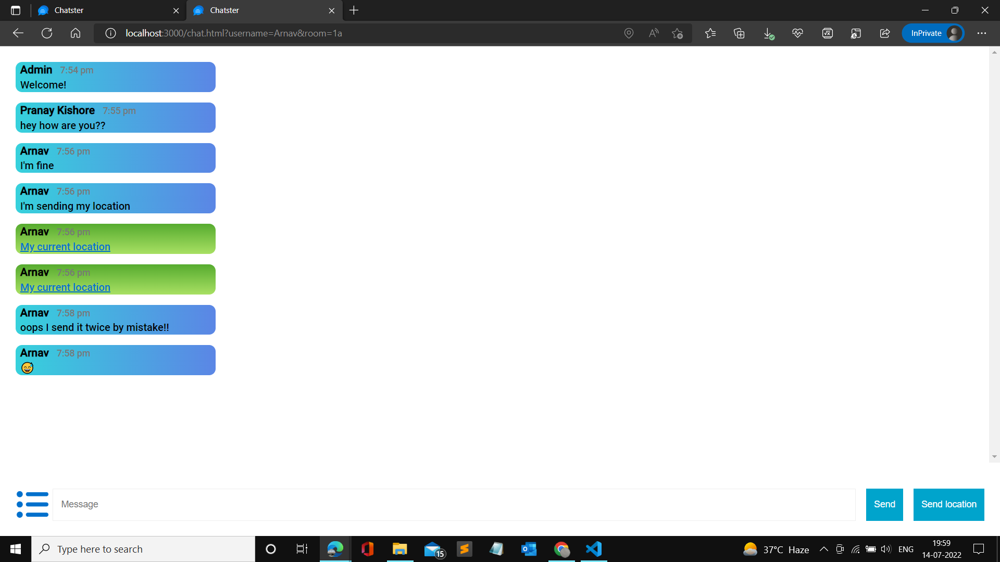
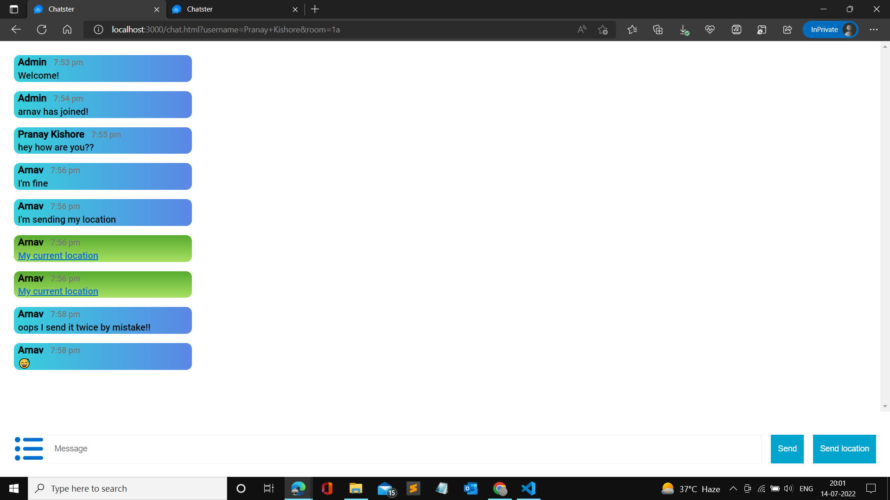
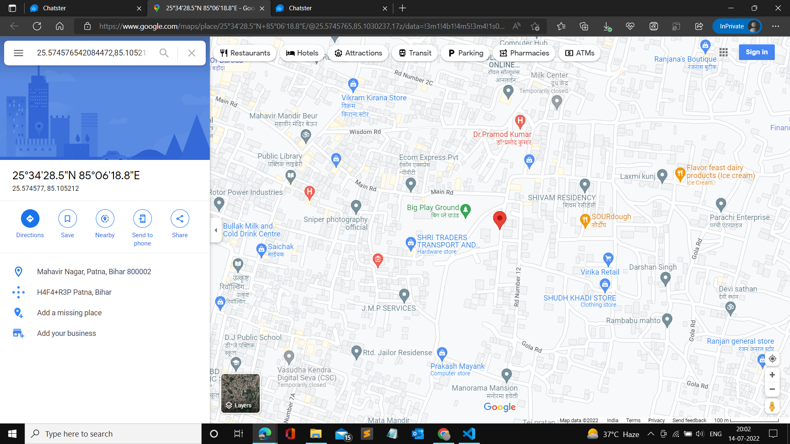
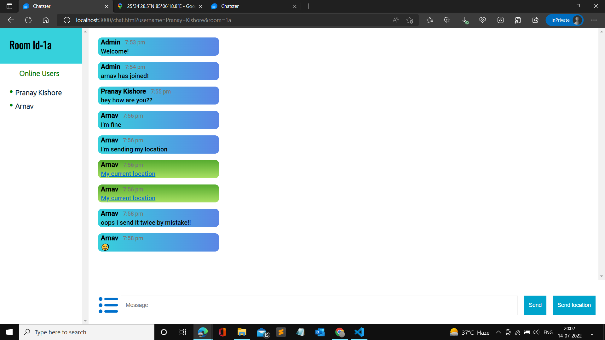
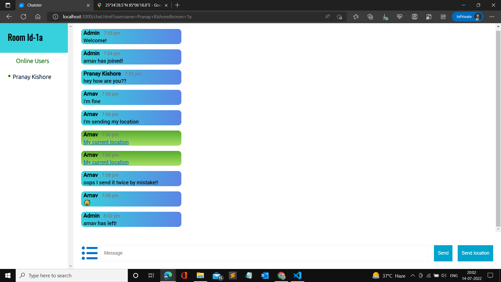

# Chatster
**This real time chat application enables you for group as well as personalised chats in separate channels and live location sharing**
## Dependencies used
   * [Express](http://expressjs.com/)
   * [Socket.IO](https://socket.io/docs/v4/)
   * [bad-words](https://www.npmjs.com/package/bad-words)

## Installation
### Cloning the repository:
- Clone the repository using `git clone https://github.com/Pranay922/Chatster.git` .
### Installing dependencies:
- Run `npm install`.

## Starting the server 
- Open terminal and Run `npm start` to start the server.
- Open http://localhost:3000 to view it in the browser.

## Home Page
  

## Chat Section
  
  

## Live Location 
  
## Online Users Section
  
  

